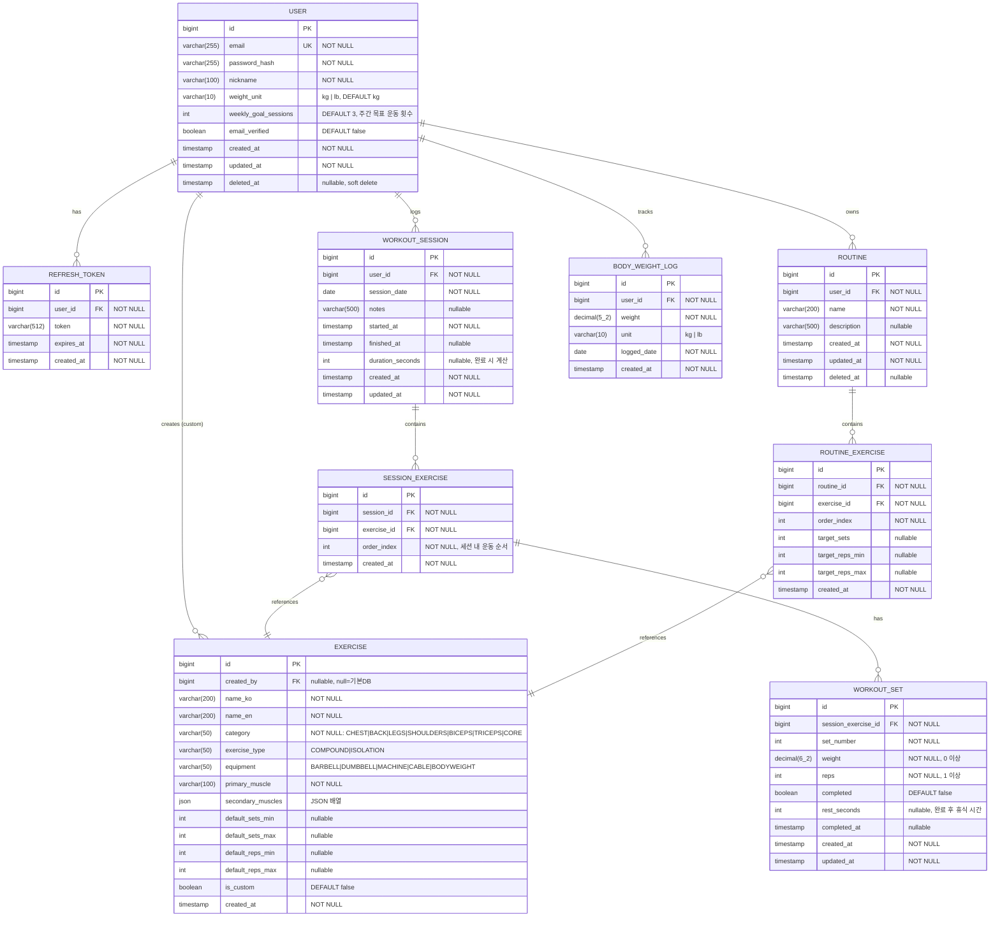

# 백엔드 설계 문서 — Overload Manager

> Spring Boot + Kotlin 기반 백엔드 설계
> 작성 기준: PRD v1 (P0 전체 + P1 일부 MVP 범위)

---

# ERD 설계

## Mermaid ERD



---

## 엔티티 상세 설명

### USER
회원 계정 정보. 소프트 삭제(`deleted_at`) 적용으로 데이터 보존. `weight_unit`은 사용자 선호 단위 (kg/lb)로, 모든 무게 데이터는 **DB에 kg으로 저장**하고 프론트에서 변환한다. `weekly_goal_sessions`는 대시보드 주간 목표 표시용 (default 3, 사용자가 수정 가능).

### REFRESH_TOKEN
JWT Refresh Token을 별도 테이블에 저장하여 토큰 폐기(revoke) 지원. 로그아웃 또는 탈취 의심 시 해당 레코드 삭제.

### EXERCISE
기본 운동 DB(`created_by = NULL`)와 사용자 커스텀 운동(`created_by = user_id`, `is_custom = true`)을 단일 테이블로 관리. `secondary_muscles`는 JSON 배열로 저장.

### WORKOUT_SESSION
하루에 복수 세션 허용 (오전/오후 분리 기록 지원). `started_at`은 생성 시 서버 시간 기록, `finished_at`은 세션 종료 버튼 클릭 시 기록.

### SESSION_EXERCISE
세션에 추가된 운동 목록. `order_index`로 순서 관리. 운동별 세트들은 `WORKOUT_SET`에 귀속.

### WORKOUT_SET
핵심 기록 단위. `weight`는 항상 kg으로 저장. `completed = false`인 세트는 계획된 세트로, `true`는 실제 완료된 세트. `rest_seconds`는 이 세트 완료 후 실제 쉰 시간.

### ROUTINE / ROUTINE_EXERCISE
P1 기능. 자주 쓰는 운동 조합 저장. 루틴을 세션에 적용하면 `SESSION_EXERCISE` 레코드들이 생성됨.

### BODY_WEIGHT_LOG
P1 기능. 날짜별 체중 기록. 단위 혼용 방지를 위해 `unit` 컬럼 별도 보관.

---

## 인덱스 전략

| 테이블 | 인덱스 | 이유 |
|---|---|---|
| USER | `UNIQUE (email)` | 로그인/중복 검사 |
| USER | `INDEX (deleted_at)` | 소프트 삭제 필터링 |
| REFRESH_TOKEN | `INDEX (user_id)` | 사용자별 토큰 조회 |
| REFRESH_TOKEN | `INDEX (expires_at)` | 만료 토큰 배치 삭제 |
| EXERCISE | `INDEX (category, is_custom)` | 카테고리별 목록 |
| EXERCISE | `INDEX (created_by)` | 사용자 커스텀 운동 목록 |
| EXERCISE | `FULLTEXT (name_ko, name_en)` | 운동명 검색 (MySQL 기준) |
| WORKOUT_SESSION | `INDEX (user_id, session_date DESC)` | 날짜순 세션 목록 |
| SESSION_EXERCISE | `INDEX (session_id, order_index)` | 세션 내 운동 순서 조회 |
| SESSION_EXERCISE | `INDEX (exercise_id)` | 특정 운동 히스토리 조회 |
| WORKOUT_SET | `INDEX (session_exercise_id, set_number)` | 세트 목록 조회 |
| BODY_WEIGHT_LOG | `INDEX (user_id, logged_date DESC)` | 날짜순 체중 목록 |
| ROUTINE | `INDEX (user_id, deleted_at)` | 사용자 루틴 목록 |

---

# REST API 명세

## 기본 규칙

- **Base URL**: `/api/v1`
- **인증**: Bearer Token (JWT Access Token) — `Authorization: Bearer <token>` 헤더
- **Content-Type**: `application/json`
- **날짜 형식**: ISO 8601 (`2026-03-19`, `2026-03-19T10:30:00Z`)
- **무게 단위**: API는 항상 `kg` 기준으로 교환, 단위 변환은 클라이언트 책임
- **페이지네이션**: `page` (0-based), `size` (default 20), `sort` 쿼리 파라미터

### 공통 에러 응답

```json
{
  "code": "INVALID_INPUT",
  "message": "요청 값이 올바르지 않습니다.",
  "details": [
    { "field": "email", "reason": "이메일 형식이 아닙니다." }
  ]
}
```

| HTTP 상태 | 에러 코드 예시 | 상황 |
|---|---|---|
| 400 | `INVALID_INPUT` | 유효성 검사 실패 |
| 401 | `UNAUTHORIZED` | 미인증 또는 토큰 만료 |
| 403 | `FORBIDDEN` | 타인 리소스 접근 |
| 404 | `NOT_FOUND` | 리소스 없음 |
| 409 | `CONFLICT` | 중복 (이메일 등) |
| 500 | `INTERNAL_ERROR` | 서버 오류 |

---

## 인증 API

### POST /api/v1/auth/register — 회원가입

**Request**
```json
{
  "email": "user@example.com",
  "password": "Password123!",
  "nickname": "철수",
  "weightUnit": "kg"
}
```

**Response 201**
```json
{
  "id": 1,
  "email": "user@example.com",
  "nickname": "철수",
  "weightUnit": "kg",
  "emailVerified": false,
  "createdAt": "2026-03-19T10:00:00Z"
}
```

**에러**: 409 `EMAIL_ALREADY_EXISTS`

---

### POST /api/v1/auth/login — 로그인

**Request**
```json
{
  "email": "user@example.com",
  "password": "Password123!"
}
```

**Response 200**
```json
{
  "accessToken": "eyJ...",
  "refreshToken": "eyJ...",
  "tokenType": "Bearer",
  "expiresIn": 3600,
  "user": {
    "id": 1,
    "email": "user@example.com",
    "nickname": "철수",
    "weightUnit": "kg"
  }
}
```

**에러**: 401 `INVALID_CREDENTIALS`

---

### POST /api/v1/auth/refresh — 토큰 갱신

**Request**
```json
{
  "refreshToken": "eyJ..."
}
```

**Response 200**
```json
{
  "accessToken": "eyJ...",
  "expiresIn": 3600
}
```

**에러**: 401 `INVALID_REFRESH_TOKEN`, `REFRESH_TOKEN_EXPIRED`

---

### POST /api/v1/auth/logout — 로그아웃

**Headers**: `Authorization: Bearer <accessToken>`

**Request**
```json
{
  "refreshToken": "eyJ..."
}
```

**Response 204** (No Content)

---

### POST /api/v1/auth/verify-email — 이메일 인증

**Request**
```json
{
  "token": "verification-uuid-token"
}
```

**Response 200**
```json
{
  "message": "이메일 인증이 완료되었습니다."
}
```

---

## 사용자 API

### GET /api/v1/users/me — 내 정보 조회

**Headers**: `Authorization: Bearer <token>`

**Response 200**
```json
{
  "id": 1,
  "email": "user@example.com",
  "nickname": "철수",
  "weightUnit": "kg",
  "emailVerified": true,
  "createdAt": "2026-03-19T10:00:00Z"
}
```

---

### PATCH /api/v1/users/me — 내 정보 수정

**Request**
```json
{
  "nickname": "철수2",
  "weightUnit": "lb",
  "weeklyGoalSessions": 4
}
```

**Response 200** — 수정된 사용자 정보 반환

---

### DELETE /api/v1/users/me — 회원 탈퇴

**Response 204** (소프트 삭제)

---

## 운동(Exercise) API

### GET /api/v1/exercises — 운동 목록 조회

**Headers**: `Authorization: Bearer <token>`

**Query Parameters**

| 파라미터 | 타입 | 설명 |
|---|---|---|
| `category` | string | `CHEST\|BACK\|LEGS\|SHOULDERS\|BICEPS\|TRICEPS\|CORE` |
| `query` | string | 운동명 검색 (한국어/영어) |
| `includeCustom` | boolean | 사용자 커스텀 운동 포함 여부 (default: true) |
| `page` | int | 페이지 번호 (default: 0) |
| `size` | int | 페이지 크기 (default: 50) |

**Response 200**
```json
{
  "content": [
    {
      "id": 1,
      "nameKo": "벤치 프레스",
      "nameEn": "Bench Press",
      "category": "CHEST",
      "exerciseType": "COMPOUND",
      "equipment": "BARBELL",
      "primaryMuscle": "대흉근",
      "secondaryMuscles": ["삼두근", "전면 삼각근"],
      "defaultSetsMin": 3,
      "defaultSetsMax": 5,
      "defaultRepsMin": 5,
      "defaultRepsMax": 12,
      "isCustom": false
    }
  ],
  "totalElements": 48,
  "totalPages": 1,
  "page": 0,
  "size": 50
}
```

---

### GET /api/v1/exercises/{exerciseId} — 운동 상세 조회

**Response 200** — 단일 운동 객체 반환

---

### POST /api/v1/exercises — 커스텀 운동 등록 (P1)

**Request**
```json
{
  "nameKo": "케이블 체스트 프레스",
  "nameEn": "Cable Chest Press",
  "category": "CHEST",
  "exerciseType": "COMPOUND",
  "equipment": "CABLE",
  "primaryMuscle": "대흉근",
  "secondaryMuscles": ["삼두근"],
  "defaultSetsMin": 3,
  "defaultSetsMax": 4,
  "defaultRepsMin": 10,
  "defaultRepsMax": 15
}
```

**Response 201** — 생성된 운동 객체 반환

---

### DELETE /api/v1/exercises/{exerciseId} — 커스텀 운동 삭제

**Response 204** — 본인 커스텀 운동만 삭제 가능, 타인 것은 403

---

## 운동 세션 API

### GET /api/v1/sessions — 세션 목록 조회

**Headers**: `Authorization: Bearer <token>`

**Query Parameters**

| 파라미터 | 타입 | 설명 |
|---|---|---|
| `from` | date | 시작 날짜 (inclusive) |
| `to` | date | 종료 날짜 (inclusive) |
| `page` | int | 페이지 번호 |
| `size` | int | 페이지 크기 |

**Response 200**
```json
{
  "content": [
    {
      "id": 10,
      "sessionDate": "2026-03-19",
      "notes": "오늘 컨디션 좋음",
      "startedAt": "2026-03-19T09:00:00Z",
      "finishedAt": "2026-03-19T10:12:00Z",
      "durationSeconds": 4320,
      "exerciseCount": 4,
      "totalSets": 12,
      "totalVolumeKg": 5240.0
    }
  ],
  "totalElements": 45,
  "totalPages": 3,
  "page": 0,
  "size": 20
}
```

---

### POST /api/v1/sessions — 세션 생성

**Request**
```json
{
  "sessionDate": "2026-03-19",
  "notes": "오늘 컨디션 좋음"
}
```

**Response 201**
```json
{
  "id": 10,
  "sessionDate": "2026-03-19",
  "notes": "오늘 컨디션 좋음",
  "startedAt": "2026-03-19T09:00:00Z",
  "finishedAt": null,
  "durationSeconds": null,
  "exercises": []
}
```

---

### GET /api/v1/sessions/{sessionId} — 세션 상세 조회

**Response 200**
```json
{
  "id": 10,
  "sessionDate": "2026-03-19",
  "notes": "오늘 컨디션 좋음",
  "startedAt": "2026-03-19T09:00:00Z",
  "finishedAt": null,
  "durationSeconds": null,
  "exerciseCount": 1,
  "totalSets": 1,
  "totalVolumeKg": 640.0,
  "exercises": [
    {
      "id": 100,
      "orderIndex": 0,
      "exercise": {
        "id": 1,
        "nameKo": "벤치 프레스",
        "category": "CHEST"
      },
      "sets": [
        {
          "id": 200,
          "setNumber": 1,
          "weightKg": 80.0,
          "reps": 8,
          "completed": true,
          "restSeconds": 120,
          "completedAt": "2026-03-19T09:10:00Z"
        }
      ]
    }
  ]
}
```

---

### PATCH /api/v1/sessions/{sessionId} — 세션 수정 (메모, 종료 처리)

**Request**
```json
{
  "notes": "수정된 메모",
  "finished": true
}
```

**Response 200**
```json
{
  "id": 10,
  "sessionDate": "2026-03-19",
  "notes": "수정된 메모",
  "startedAt": "2026-03-19T09:00:00Z",
  "finishedAt": "2026-03-19T10:12:00Z",
  "durationSeconds": 4320,
  "exerciseCount": 4,
  "totalSets": 12,
  "totalVolumeKg": 5240.0,
  "exercises": []
}
```

`finished: true`이면 서버에서 `finishedAt` 및 `durationSeconds` 계산 기록. 집계 필드(`exerciseCount`, `totalSets`, `totalVolumeKg`)가 응답에 포함되어 세션 종료 요약 모달을 바로 렌더링 가능. `exercises`는 종료 응답에서 빈 배열로 반환 (이미 클라이언트가 보유).

---

### DELETE /api/v1/sessions/{sessionId} — 세션 삭제

**Response 204**

---

### POST /api/v1/sessions/{sessionId}/exercises — 세션에 운동 추가

**Request**
```json
{
  "exerciseIds": [1, 3, 5]
}
```

**Response 201**
```json
{
  "added": [
    {
      "id": 100,
      "orderIndex": 0,
      "exercise": { "id": 1, "nameKo": "벤치 프레스" },
      "sets": []
    }
  ]
}
```

---

### DELETE /api/v1/sessions/{sessionId}/exercises/{sessionExerciseId} — 세션에서 운동 제거

**Response 204**

---

## 세트 기록 API

### POST /api/v1/sessions/{sessionId}/exercises/{sessionExerciseId}/sets — 세트 추가

`setNumber`는 클라이언트가 생략 시 서버가 자동 채번 (현재 세트 수 + 1). 명시적으로 전달하면 해당 값 사용.

**Request**
```json
{
  "weightKg": 80.0,
  "reps": 8
}
```

**Response 201**
```json
{
  "id": 200,
  "setNumber": 1,
  "weightKg": 80.0,
  "reps": 8,
  "completed": false,
  "restSeconds": null,
  "completedAt": null,
  "createdAt": "2026-03-19T09:05:00Z"
}
```

---

### PATCH /api/v1/sessions/{sessionId}/exercises/{sessionExerciseId}/sets/{setId} — 세트 수정/완료

**Request**
```json
{
  "weightKg": 82.5,
  "reps": 8,
  "completed": true,
  "restSeconds": 120
}
```

**Response 200** — 수정된 세트 반환. `completed: true`이면 서버에서 `completedAt` 기록.

---

### DELETE /api/v1/sessions/{sessionId}/exercises/{sessionExerciseId}/sets/{setId} — 세트 삭제

**Response 204**

---

## 이전 기록 조회 API (P0-5 핵심)

### GET /api/v1/exercises/{exerciseId}/previous-session — 직전 세션 기록 조회

운동 중 참고용. 현재 활성 세션을 제외한 가장 최근 완료 세션의 해당 운동 세트 반환.

**Query Parameters**

| 파라미터 | 타입 | 설명 |
|---|---|---|
| `excludeSessionId` | long | 현재 세션 ID (제외) |

**Response 200**
```json
{
  "sessionId": 9,
  "sessionDate": "2026-03-15",
  "sets": [
    { "setNumber": 1, "weightKg": 80.0, "reps": 8, "completed": true },
    { "setNumber": 2, "weightKg": 80.0, "reps": 8, "completed": true },
    { "setNumber": 3, "weightKg": 80.0, "reps": 7, "completed": true }
  ],
  "totalVolumeKg": 1840.0
}
```

**Response 200 (이전 기록 없음)**
```json
{
  "sessionId": null,
  "sessionDate": null,
  "sets": [],
  "totalVolumeKg": 0.0
}
```

> 404 대신 빈 데이터 200 응답으로 변경. 프론트엔드에서 에러와 "기록 없음" 상태를 구분하지 않아도 되며, `sets.length === 0` 체크로 처리.

---

## 운동 히스토리 / 리포트 API

### GET /api/v1/exercises/{exerciseId}/history — 운동별 히스토리 목록 (P0-6)

**Query Parameters**

| 파라미터 | 타입 | 설명 |
|---|---|---|
| `from` | date | 시작 날짜 |
| `to` | date | 종료 날짜 |
| `page` | int | 페이지 번호 |
| `size` | int | 페이지 크기 |

**Response 200**
```json
{
  "content": [
    {
      "sessionId": 10,
      "sessionDate": "2026-03-19",
      "sets": [
        { "setNumber": 1, "weightKg": 82.5, "reps": 8, "completed": true }
      ],
      "maxWeightKg": 82.5,
      "totalVolumeKg": 1980.0,
      "estimatedOneRepMax": 106.5
    }
  ],
  "totalElements": 30,
  "totalPages": 2,
  "page": 0,
  "size": 20
}
```

---

### GET /api/v1/exercises/{exerciseId}/volume-trend — 볼륨 트렌드 (P1-2)

**Query Parameters**

| 파라미터 | 타입 | 설명 |
|---|---|---|
| `period` | string | `WEEKLY` \| `MONTHLY` |
| `from` | date | 시작 날짜 |
| `to` | date | 종료 날짜 |

**Response 200**
```json
{
  "exerciseId": 1,
  "exerciseName": "벤치 프레스",
  "period": "WEEKLY",
  "data": [
    { "periodLabel": "2026-W10", "startDate": "2026-03-02", "totalVolumeKg": 4800.0, "maxWeightKg": 80.0 },
    { "periodLabel": "2026-W11", "startDate": "2026-03-09", "totalVolumeKg": 5120.0, "maxWeightKg": 82.5 }
  ]
}
```

---

### GET /api/v1/reports/weekly-summary — 주간 요약 리포트

**Query Parameters**

| 파라미터 | 타입 | 설명 |
|---|---|---|
| `date` | date | 해당 주의 임의 날짜 (default: 오늘) |

**Response 200**
```json
{
  "weekStart": "2026-03-16",
  "weekEnd": "2026-03-22",
  "sessionCount": 3,
  "weeklyGoalSessions": 4,
  "totalSets": 36,
  "totalVolumeKg": 18400.0,
  "previousWeekVolumeKg": 17000.0,
  "volumeChangePercent": 8.2,
  "overloadAchieved": [
    { "exerciseId": 1, "exerciseName": "벤치 프레스", "achieved": true },
    { "exerciseId": 2, "exerciseName": "데드리프트", "achieved": false }
  ]
}
```

---

## 루틴 API (P1-5)

### GET /api/v1/routines — 루틴 목록

**Response 200**
```json
[
  {
    "id": 1,
    "name": "상체 A",
    "description": "가슴+등 복합",
    "exerciseCount": 4,
    "createdAt": "2026-01-01T00:00:00Z"
  }
]
```

---

### POST /api/v1/routines — 루틴 생성

**Request**
```json
{
  "name": "상체 A",
  "description": "가슴+등 복합",
  "exercises": [
    { "exerciseId": 1, "orderIndex": 0, "targetSets": 4, "targetRepsMin": 6, "targetRepsMax": 8 },
    { "exerciseId": 3, "orderIndex": 1, "targetSets": 3, "targetRepsMin": 8, "targetRepsMax": 12 }
  ]
}
```

**Response 201** — 생성된 루틴 상세 반환

---

### POST /api/v1/routines/{routineId}/apply — 루틴을 세션에 적용

**Request**
```json
{
  "sessionId": 10
}
```

**Response 200**
```json
{
  "sessionId": 10,
  "addedExercises": [
    { "id": 100, "orderIndex": 0, "exercise": { "id": 1, "nameKo": "벤치 프레스" } }
  ]
}
```

---

### DELETE /api/v1/routines/{routineId} — 루틴 삭제

**Response 204** (소프트 삭제)

---

## 1RM 계산 API (P1-1)

### GET /api/v1/exercises/{exerciseId}/estimated-1rm — 추정 1RM 조회

Epley 공식: `1RM = weight × (1 + reps / 30)`
최근 세트 기록 중 가장 높은 추정 1RM 반환.

**Response 200**
```json
{
  "exerciseId": 1,
  "estimatedOneRepMax": 106.5,
  "basedOnSet": {
    "weightKg": 82.5,
    "reps": 8,
    "sessionDate": "2026-03-19"
  }
}
```

---

# 프로젝트 구조

## 모듈 구조

**단일 모듈(Single Module)** 채택.

**근거**: MVP 단계에서는 팀 규모가 작고, 도메인 경계가 아직 확정되지 않은 상태. 멀티모듈은 초기 오버헤드(빌드 설정, 모듈 간 의존성 관리)가 크다. 트래픽 규모나 독립 배포 요구가 생기는 시점에 모듈 분리를 진행하는 것이 pragmatic.

추후 분리 기준점:
- 인증 서버 분리 필요 시 → `auth-service` 모듈
- 리포트 집계 쿼리 부하 증가 시 → `report-service` 모듈 또는 CQRS 적용

---

## 패키지 구조

```
com.overloadmanager
├── OverloadManagerApplication.kt
│
├── config/                        # 설정 클래스
│   ├── SecurityConfig.kt          # Spring Security, JWT 필터 등록
│   ├── JpaConfig.kt               # JPA Auditing 설정
│   └── WebMvcConfig.kt            # CORS, Interceptor
│
├── common/                        # 공통 유틸리티
│   ├── exception/
│   │   ├── AppException.kt        # 커스텀 예외 베이스
│   │   ├── ErrorCode.kt           # 에러 코드 enum
│   │   └── GlobalExceptionHandler.kt
│   ├── response/
│   │   ├── ApiResponse.kt         # 표준 응답 래퍼
│   │   └── PageResponse.kt
│   └── util/
│       └── OneRmCalculator.kt     # Epley 공식
│
├── auth/                          # 인증 도메인
│   ├── controller/
│   │   └── AuthController.kt
│   ├── service/
│   │   └── AuthService.kt
│   ├── repository/
│   │   └── RefreshTokenRepository.kt
│   ├── domain/
│   │   └── RefreshToken.kt        # JPA Entity
│   └── dto/
│       ├── LoginRequest.kt
│       ├── LoginResponse.kt
│       └── RegisterRequest.kt
│
├── user/                          # 사용자 도메인
│   ├── controller/
│   │   └── UserController.kt
│   ├── service/
│   │   └── UserService.kt
│   ├── repository/
│   │   └── UserRepository.kt
│   ├── domain/
│   │   └── User.kt
│   └── dto/
│
├── exercise/                      # 운동 도메인
│   ├── controller/
│   │   └── ExerciseController.kt
│   ├── service/
│   │   └── ExerciseService.kt
│   ├── repository/
│   │   └── ExerciseRepository.kt
│   ├── domain/
│   │   └── Exercise.kt
│   └── dto/
│
├── workout/                       # 운동 세션/세트 도메인 (핵심)
│   ├── controller/
│   │   ├── WorkoutSessionController.kt
│   │   └── WorkoutSetController.kt
│   ├── service/
│   │   ├── WorkoutSessionService.kt
│   │   ├── WorkoutSetService.kt
│   │   └── OverloadDetectionService.kt  # 과부하 달성 감지
│   ├── repository/
│   │   ├── WorkoutSessionRepository.kt
│   │   ├── SessionExerciseRepository.kt
│   │   └── WorkoutSetRepository.kt
│   ├── domain/
│   │   ├── WorkoutSession.kt
│   │   ├── SessionExercise.kt
│   │   └── WorkoutSet.kt
│   └── dto/
│
├── routine/                       # 루틴 도메인 (P1)
│   ├── controller/
│   ├── service/
│   ├── repository/
│   ├── domain/
│   └── dto/
│
├── report/                        # 리포트/분석 도메인
│   ├── controller/
│   │   └── ReportController.kt
│   ├── service/
│   │   └── ReportService.kt
│   └── dto/
│
└── infrastructure/                # 인프라 레이어
    ├── jwt/
    │   ├── JwtTokenProvider.kt
    │   └── JwtAuthenticationFilter.kt
    └── email/
        └── EmailService.kt        # 이메일 인증 발송
```

---

## 주요 의존성

```kotlin
// build.gradle.kts

plugins {
    kotlin("jvm") version "1.9.25"
    kotlin("plugin.spring") version "1.9.25"
    kotlin("plugin.jpa") version "1.9.25"
    id("org.springframework.boot") version "3.3.x"
    id("io.spring.dependency-management") version "1.1.x"
}

dependencies {
    // Spring Boot Core
    implementation("org.springframework.boot:spring-boot-starter-web")
    implementation("org.springframework.boot:spring-boot-starter-validation")

    // Security & JWT
    implementation("org.springframework.boot:spring-boot-starter-security")
    implementation("io.jsonwebtoken:jjwt-api:0.12.x")
    runtimeOnly("io.jsonwebtoken:jjwt-impl:0.12.x")
    runtimeOnly("io.jsonwebtoken:jjwt-jackson:0.12.x")

    // Database
    implementation("org.springframework.boot:spring-boot-starter-data-jpa")
    implementation("org.flywaydb:flyway-core")         // DB 마이그레이션
    implementation("org.flywaydb:flyway-mysql")
    runtimeOnly("com.mysql:mysql-connector-j")

    // Kotlin
    implementation("com.fasterxml.jackson.module:jackson-module-kotlin")
    implementation("org.jetbrains.kotlin:kotlin-reflect")

    // Email
    implementation("org.springframework.boot:spring-boot-starter-mail")

    // Test
    testImplementation("org.springframework.boot:spring-boot-starter-test")
    testImplementation("org.springframework.security:spring-security-test")
    testImplementation("com.h2database:h2")            // 테스트용 인메모리 DB
}
```

### 의존성 선택 근거

| 의존성 | 이유 |
|---|---|
| **Spring Security** | JWT 필터 체인 구성, 비밀번호 BCrypt 해싱 |
| **jjwt (JJWT)** | Kotlin/Java 표준 JWT 라이브러리, type-safe API |
| **Spring Data JPA** | 도메인 모델 중심 DB 접근, Repository 추상화 |
| **Flyway** | DB 스키마 버전 관리, 팀 환경 일관성 보장 |
| **spring-boot-starter-validation** | `@Valid`, `@NotNull` 등 Bean Validation |
| **spring-boot-starter-mail** | 이메일 인증 발송 |
| **H2 (테스트)** | 단위/통합 테스트 시 인메모리 DB |

---

## API 버전닝 전략

- **URL Path Versioning**: `/api/v1/...`
- 초기 버전은 `v1` 단일 운영
- Breaking change 발생 시 `/api/v2/...` 신규 추가, `v1`은 deprecation 기간(최소 3개월) 후 제거
- Response에 `Deprecation` 헤더로 클라이언트에 사전 고지

---

## JWT 설계

| 항목 | 값 |
|---|---|
| Access Token 유효 기간 | 1시간 |
| Refresh Token 유효 기간 | 30일 |
| Access Token Payload | `sub` (userId), `email`, `iat`, `exp` |
| 저장 위치 | Access: 메모리(클라이언트), Refresh: DB + **HttpOnly Cookie** (`withCredentials: true`) |
| 갱신 전략 | Refresh Token Rotation — 갱신 시 기존 Refresh Token 폐기 후 신규 발급 |

---

## 보안 고려사항

1. **비밀번호**: BCrypt (strength 10) 해싱 저장
2. **SQL Injection**: JPA/Prepared Statement 사용으로 방지
3. **CORS**: `allowedOrigins`에 프론트엔드 도메인 명시적 지정 (와일드카드 불가), `allowCredentials: true` 설정 — HttpOnly Cookie 방식 채택에 따른 필수 설정
4. **Rate Limiting**: 로그인 엔드포인트에 Spring Cloud Gateway 또는 Bucket4j로 제한 (MVP 이후)
5. **데이터 격리**: 모든 도메인 Service에서 `userId` 기준 소유권 검증 (`@PreAuthorize` 또는 명시적 체크)
6. **HTTPS**: 운영 환경 필수, 개발은 HTTP 허용

---

## Flyway 마이그레이션 구조

```
src/main/resources/db/migration/
├── V1__create_users.sql
├── V2__create_refresh_tokens.sql
├── V3__create_exercises.sql
├── V4__insert_default_exercises.sql
├── V5__create_workout_sessions.sql
├── V6__create_session_exercises.sql
├── V7__create_workout_sets.sql
├── V8__create_routines.sql
└── V9__create_body_weight_logs.sql
```
