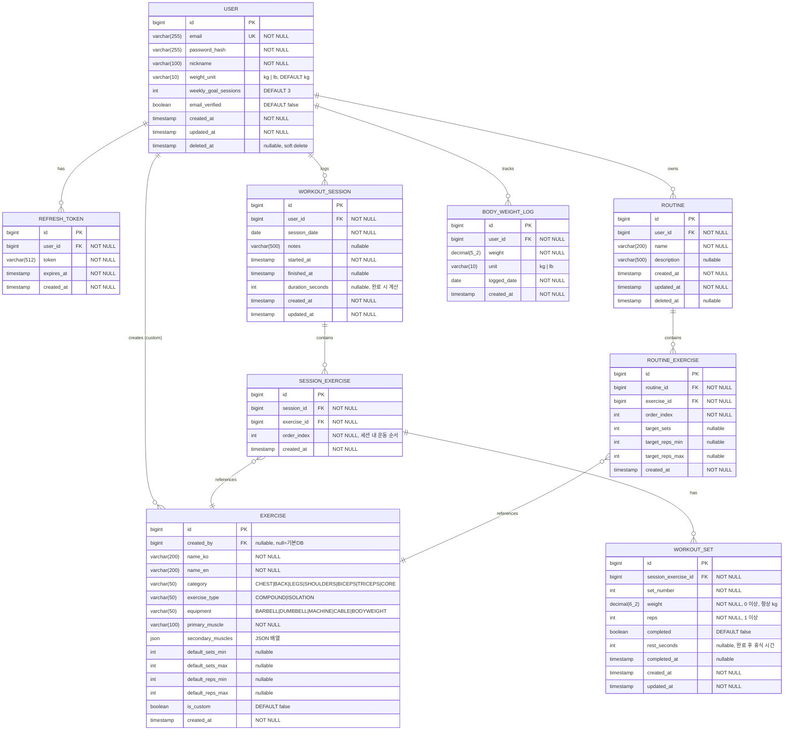

# Overload Manager — 설계 문서

> 헬스 트레이닝 과부하 관리 웹 애플리케이션 설계 산출물
> 작성일: 2026-03-19

---

# 1. PRD (Product Requirements Document)

## 1.1 핵심 가치 및 타겟 유저

### 제품 비전
**"Overload Manager"** — 점진적 과부하(Progressive Overload) 원칙을 기반으로, 운동별 무게·세트·반복수·휴식시간을 체계적으로 기록하고 분석하여 트레이닝 효율을 극대화하는 웹 애플리케이션

### 핵심 가치
1. **과부하 가시화**: 운동별 볼륨(세트 x 반복수 x 무게), 강도 변화 추이를 한눈에 파악
2. **스마트 가이드**: 1RM 기반 권장 중량, 적절한 세트/반복수 프로그램 제안
3. **지속성 동기 부여**: 개인화된 리포트·뱃지·기록 갱신 알림으로 꾸준한 트레이닝 유도
4. **간단한 기록**: 운동 중 최소한의 입력으로 빠르게 로그 작성

### 타겟 유저

| 세그먼트 | 설명 | 주요 니즈 |
|---|---|---|
| **초급자 (Beginner)** | 헬스 시작 6개월 미만, 기본 동작 학습 중 | 운동 선택 가이드, 기초 중량 설정 |
| **중급자 (Intermediate)** | 6개월~3년, 주 3~5회 규칙 운동 | 과부하 추적, 프로그램 관리, 정체기 탈출 |
| **고급자 (Advanced)** | 3년 이상, 체계적 프로그램 운용 | 상세 볼륨 분석, 주기화(Periodization) 관리 |

**핵심 페르소나**: 20~35세, 주 3회 이상 헬스장 방문, 기록 관리를 하고 싶지만 기존 노트/엑셀 방식이 불편한 중급자

## 1.2 기능 목록 (P0/P1/P2)

### P0 — MVP 필수 기능 (없으면 출시 불가)

| ID | 기능 | 설명 |
|---|---|---|
| P0-1 | 회원가입/로그인 | 이메일+비밀번호 인증, JWT 기반 세션 |
| P0-2 | 운동 목록 관리 | 운동 카테고리별 검색·선택 (기본 운동 DB 제공) |
| P0-3 | 운동 세션 기록 | 날짜별 운동 세션 생성, 운동 추가 |
| P0-4 | 세트 기록 | 세트별 무게(kg/lb)·반복수 입력, 완료 체크 |
| P0-5 | 이전 기록 조회 | 직전 세션의 운동별 무게·반복수 표시 (운동 중 참고용) |
| P0-6 | 운동 히스토리 | 운동별 과거 기록 목록 조회 |

### P1 — 핵심 차별화 기능 (MVP 이후 빠르게 추가)

| ID | 기능 | 설명 |
|---|---|---|
| P1-1 | 1RM 계산기 | Epley 공식 기반 추정 1RM 계산 및 저장 |
| P1-2 | 볼륨 트렌드 차트 | 운동별 주간/월간 총 볼륨(세트x반복x무게) 시각화 |
| P1-3 | 과부하 달성 알림 | 이전 세션 대비 중량 또는 볼륨 향상 시 알림 |
| P1-4 | 휴식 타이머 | 세트 완료 후 지정 시간 카운트다운 타이머 |
| P1-5 | 운동 루틴 템플릿 | 자주 쓰는 운동 조합을 루틴으로 저장·재사용 |
| P1-6 | 개인 운동 추가 | 기본 DB에 없는 커스텀 운동 등록 |
| P1-7 | 몸무게 로그 | 날짜별 체중 기록 및 그래프 |

### P2 — 고도화 기능 (중장기 로드맵)

| ID | 기능 | 설명 |
|---|---|---|
| P2-1 | 디로드(Deload) 주 알림 | 누적 볼륨/피로도 기반 디로드 시기 추천 |
| P2-2 | 프로그램 설계 | 5x5, 3x8-12, 피라미드 등 프리셋 프로그램 자동 생성 |
| P2-3 | 소셜 기능 | 운동 기록 공유, 친구 랭킹 |
| P2-4 | 영양 관리 연동 | 칼로리·단백질 섭취 로그 |
| P2-5 | 모바일 앱 | iOS/Android 네이티브 또는 PWA |
| P2-6 | AI 중량 추천 | 과거 데이터 기반 다음 세션 목표 중량 자동 제안 |
| P2-7 | 신체 측정 기록 | 부위별 둘레·체지방률 등 신체 계측 데이터 |

## 1.3 유저 스토리

### 인증

- **US-01**: As a **신규 사용자**, I want to **이메일과 비밀번호로 계정을 만들** so that **내 운동 기록을 영구적으로 저장할 수 있다**.
- **US-02**: As a **기존 사용자**, I want to **저장된 자격증명으로 빠르게 로그인할** so that **운동 전 준비 시간을 최소화할 수 있다**.

### 운동 선택 및 관리

- **US-03**: As a **사용자**, I want to **카테고리(가슴/등/하체/어깨/팔/코어)별로 운동을 검색하고 선택할** so that **원하는 운동을 빠르게 찾을 수 있다**.
- **US-04**: As a **고급 사용자**, I want to **기본 DB에 없는 운동을 직접 추가할** so that **특수 장비나 변형 동작도 기록할 수 있다**.
- **US-05**: As a **사용자**, I want to **각 운동에 대한 기본 정보(주동근, 운동 유형, 권장 반복수 범위)를 확인할** so that **올바른 운동 선택에 도움을 받을 수 있다**.

### 운동 기록

- **US-06**: As a **사용자**, I want to **오늘의 운동 세션을 생성하고 여러 운동을 추가할** so that **하루 전체 운동을 하나의 세션으로 관리할 수 있다**.
- **US-07**: As a **사용자**, I want to **각 운동의 세트별로 무게와 반복수를 입력하고 완료 체크할** so that **실시간으로 운동 진행 상황을 기록할 수 있다**.
- **US-08**: As a **사용자**, I want to **운동 중 직전 세션의 같은 운동 기록(무게·반복수)을 볼** so that **오늘의 목표 중량을 쉽게 결정할 수 있다**.
- **US-09**: As a **사용자**, I want to **세트 완료 후 휴식 타이머를 시작할** so that **적절한 휴식 시간을 지킬 수 있다**.
- **US-10**: As a **사용자**, I want to **실수로 입력한 세트 기록을 수정하거나 삭제할** so that **정확한 기록을 유지할 수 있다**.

### 과부하 추적 및 분석

- **US-11**: As a **사용자**, I want to **특정 운동의 시간에 따른 최대 무게 변화를 그래프로 볼** so that **내 근력 성장 추이를 시각적으로 확인할 수 있다**.
- **US-12**: As a **사용자**, I want to **주간/월간 총 볼륨(세트x반복x무게)을 운동별로 확인할** so that **충분한 훈련 자극을 주고 있는지 파악할 수 있다**.
- **US-13**: As a **사용자**, I want to **1RM을 직접 입력하거나 실제 수행 기록으로 추정치를 계산할** so that **내 현재 절대적인 근력 수준을 파악하고 훈련 강도를 설정할 수 있다**.
- **US-14**: As a **사용자**, I want to **이전 세션보다 더 많은 무게나 볼륨을 달성했을 때 알림을 받을** so that **점진적 과부하를 달성하는 성취감을 느낄 수 있다**.

### 루틴 관리

- **US-15**: As a **사용자**, I want to **자주 사용하는 운동 조합을 루틴으로 저장할** so that **매번 운동을 일일이 추가하지 않고 빠르게 세션을 시작할 수 있다**.
- **US-16**: As a **사용자**, I want to **저장된 루틴을 불러와 오늘의 세션으로 시작할** so that **일관된 훈련 프로그램을 쉽게 유지할 수 있다**.

## 1.4 MVP 범위

### MVP 포함 (P0 전체 + P1 일부)

| 기능 | 우선순위 | 포함 이유 |
|---|---|---|
| 회원가입/로그인 (이메일) | P0 | 기본 인증 없이 서비스 불가 |
| 운동 카테고리·검색·선택 | P0 | 핵심 서비스 진입점 |
| 운동 세션 생성 및 운동 추가 | P0 | 기록의 기본 단위 |
| 세트별 무게·반복수 기록 | P0 | 핵심 기능 |
| 이전 세션 기록 조회 (운동 중) | P0 | 과부하 실현의 핵심 UX |
| 운동별 히스토리 목록 | P0 | 기록의 가치를 바로 확인 |
| 휴식 타이머 | P1 | 운동 경험 완성도, 구현 단순 |
| 최대 중량 추이 차트 | P1 | 과부하 추적의 시각화, 킬러 기능 |

### MVP 제외 (P1 일부 + P2 전체)

- 1RM 계산기 (MVP 이후 빠른 후속 릴리즈)
- 루틴 템플릿 저장 (2차 스프린트)
- 볼륨 분석 대시보드 (2차 스프린트)
- 소셜·공유·AI 추천 (장기 로드맵)

### MVP 기술 전제
- 웹 우선, 모바일 반응형 대응
- 백엔드: Spring Boot + Kotlin
- 프론트엔드: React 18 + TypeScript (팀 합의 확정)
- 인증: JWT (access token + refresh token)
- 데이터: 사용자별 완전 격리

---

# 2. 유저 플로우

## 2.1 전체 플로우 개요

```
[진입] --> [인증] --> [대시보드] --> [운동 세션] --> [세트 기록] --> [세션 종료] --> [리포트]
                          |
                          +---> [운동 관리] --> [루틴 관리]
```

## 2.2 상세 유저 플로우

### Flow 1: 신규 사용자 온보딩

```
앱 접속
  |
  v
[랜딩 페이지]
  +-- "시작하기" 클릭 --> [회원가입 페이지]
  |                          |
  |                    이메일, 비밀번호 입력
  |                    (비밀번호 확인 포함)
  |                          |
  |                    [이메일 인증 발송]
  |                          |
  |                    인증 링크 클릭
  |                          |
  |                    [프로필 초기 설정]
  |                    (닉네임, 단위 kg/lb 선택)
  |                          |
  |                    [대시보드 진입]
  |
  +-- "로그인" 클릭 --> [로그인 페이지]
                          |
                    이메일 + 비밀번호 입력
                          |
                    인증 성공
                          |
                    [대시보드]
```

### Flow 2: 운동 세션 시작

```
[대시보드]
  |
  +-- "오늘 운동 시작" 버튼 클릭
  |       |
  |       v
  |  [새 세션 생성]
  |  (오늘 날짜 자동 설정, 메모 옵션)
  |       |
  |       v
  |  [운동 추가 화면]
  |  - 카테고리 탭: [가슴] [등] [하체] [어깨] [팔] [코어] [전체]
  |  - 검색창
  |  - 운동 목록 (체크박스 복수 선택)
  |       |
  |  운동 선택 (복수 가능) --> "추가" 확인
  |       |
  |       v
  |  [세션 운동 목록 화면]
  |
  +-- 저장된 루틴 불러오기 (P1)
          |
          v
     [루틴 선택] --> [세션 운동 목록 화면]
```

### Flow 3: 세트 기록 (핵심 플로우)

```
[세션 운동 목록 화면]
  |
  운동 항목 탭 (예: 벤치 프레스)
  |
  v
[운동 세트 기록 화면]
  - 운동명 + 직전 세션 기록 표시
  - Set 1: [무게] x [반복수] [완료 체크]
  - Set 2: [무게] x [반복수] [완료 체크]
  - Set 3: [무게] x [반복수] [진행 중]
  - [+ 세트 추가]
  - [휴식 타이머]
  |
  세트 완료 체크 시
  |
  v
[휴식 타이머 팝업]
  - 카운트다운 표시
  - [+30초] [건너뜀]
  |
  타이머 종료 또는 건너뜀
  |
  v
다음 세트 기록 반복
  |
  v
모든 세트 완료 --> [다음 운동] 또는 [세션 목록]
```

### Flow 4: 과부하 설정 및 목표 중량 결정

```
[운동 세트 기록 화면]
  |
  "이전 기록 보기" 탭
  |
  v
[과부하 참고 정보 패널 (바텀시트)]
  - 직전 세션 세트별 기록
  - 추정 1RM
  - 오늘 목표 제안:
    옵션 A: 중량 증가 (예: 82.5kg x 8회)
    옵션 B: 반복수 증가 (예: 80kg x 9회)
  - 최근 8주 최대 중량 미니 차트
  |
  목표 선택 시 입력 필드 자동 채움
```

### Flow 5: 세션 종료 및 요약

```
[세션 운동 목록 화면]
  |
  "세션 종료" 버튼 클릭
  |
  v
[세션 요약 모달]
  - 총 운동 수, 총 세트, 총 볼륨, 소요 시간
  - 신기록 표시
  - [홈으로] [리포트 보기]
```

### Flow 6: 리포트 조회

```
[대시보드] --> [리포트 메뉴]
  |
  v
[리포트 메인 화면]
  +-- [운동별 탭]
  |     - 운동 선택 드롭다운
  |     - 최대 중량 추이 그래프 (라인차트)
  |     - 주간 볼륨 그래프 (바차트)
  |     - 추정 1RM
  |     - 세션 기록 목록
  |
  +-- [주간 요약 탭]
        - 주간 네비게이션
        - 운동 횟수 / 총 볼륨 / 과부하 달성
        - 지난 주 대비 볼륨 달성률
        - 과부하 달성 현황 (운동별)
        - 요일별 운동 캘린더 도트
```

## 2.3 운동 카테고리 및 기본 운동 DB

| 카테고리 | 주요 복합 운동 | 주요 고립 운동 |
|---|---|---|
| 가슴 | 벤치 프레스, 인클라인 벤치 프레스, 딥스 | 덤벨 플라이, 케이블 플라이, 펙 덱 머신 |
| 등 | 데드리프트, 바벨 로우, 풀업/친업, 시티드 케이블 로우 | 랫 풀다운, 원암 덤벨 로우, 페이스 풀 |
| 하체 | 스쿼트, 레그 프레스, 루마니안 데드리프트, 런지 | 레그 익스텐션, 레그 컬, 힙 어브덕션, 카프 레이즈 |
| 어깨 | 오버헤드 프레스 (바벨/덤벨) | 사이드 레터럴 레이즈, 프론트 레이즈, 리어 델트 플라이 |
| 팔(이두) | - | 바벨 컬, 덤벨 컬, 해머 컬, 케이블 컬 |
| 팔(삼두) | - | 트라이셉스 푸시다운, 오버헤드 익스텐션, 스컬크러셔 |
| 코어 | - | 플랭크, 크런치, 레그 레이즈, 케이블 크런치 |

### 운동 속성

- `name`: 운동명 (한국어 + 영어)
- `category`: 카테고리 (가슴/등/하체/어깨/팔/코어)
- `type`: 복합 운동 / 고립 운동
- `equipment`: 바벨 / 덤벨 / 머신 / 케이블 / 맨몸
- `primaryMuscle`: 주동근
- `secondaryMuscles`: 협력근 목록
- `defaultSets`: 권장 세트 수 (예: 3~5)
- `defaultReps`: 권장 반복수 범위 (예: 5~12)

## 2.4 과부하 원칙 적용 가이드

### 점진적 과부하 유형

| 유형 | 방법 | 권장 상황 |
|---|---|---|
| 중량 증가 | 동일 세트/반복에서 무게 증가 | 목표 반복수 상단 달성 시 |
| 반복수 증가 | 동일 중량에서 반복수 증가 | 중량 증가 전 단계 |
| 세트 증가 | 동일 세트당 볼륨 유지, 세트 수 추가 | 볼륨 단계적 증가 시 |
| 휴식 단축 | 동일 볼륨에서 휴식 시간 감소 | 대사 컨디셔닝 향상 |

### 중량 증가 기준

- **바벨 복합 운동**: 목표 반복수 최상단 2회 연속 달성 시 2.5kg 증가 권장
- **덤벨/고립 운동**: 목표 반복수 최상단 2회 연속 달성 시 1~2kg 증가 권장
- **하체 복합 운동**: 더 큰 점프 가능 (스쿼트/데드리프트 5kg 단위)

## 2.5 에러 및 예외 플로우

| 상황 | 처리 방법 |
|---|---|
| 세션 도중 앱 이탈/새로고침 | 로컬 임시 저장 + 재접속 시 복원 |
| 동일 날짜에 세션 중복 생성 | 허용 (오전/오후 운동 분리 기록 지원) |
| 무게 0 또는 음수 입력 | 클라이언트 측 유효성 검사로 방지 |
| 오프라인 상태 | 기록 불가 안내 (MVP), 오프라인 캐시는 P2 |
| 비로그인 접근 | 로그인 페이지로 리다이렉트 |

---

# 3. 와이어프레임 설명 (화면별)

> 설계 원칙: 모바일 퍼스트(Mobile First) 반응형 웹, 운동 중 한 손 조작 가능한 대형 터치 타겟, 최소 입력 횟수로 세트 기록 완료

## 3.1 로그인/회원가입 화면

### 레이아웃 구조

```
+-----------------------------+  (max-width: 480px, 중앙 정렬)
|                             |
|    [로고: Overload Manager] |  <- 상단 로고 (SVG 바벨 아이콘 + 텍스트)
|                             |
|  +--- 이메일 입력 --------+ |  <- Input (type=email, 44px height)
|  +--- 비밀번호 [보기] ----+ |  <- Input (type=password) + 토글 아이콘
|                             |
|  [         로그인          ]|  <- Primary CTA 버튼 (full width, 52px)
|                             |
|  [Google로 로그인]          |  <- 소셜 로그인 (향후 지원, 비활성 처리)
|                             |
|  계정이 없으신가요? [회원가입]|
|  [비밀번호 찾기]            |
+-----------------------------+
```

### 회원가입 폼 (탭 전환)

```
+-----------------------------+
|  [로그인] [회원가입]        |  <- 탭 네비게이션, 활성 탭 언더라인
|                             |
|  +--- 닉네임 입력 --------+ |
|  +--- 이메일 입력 --------+ |
|  +--- 비밀번호 입력 ------+ |
|  +--- 비밀번호 확인 ------+ |
|                             |
|  무게 단위: (o) kg  ( ) lb  |  <- 라디오 버튼 (기본: kg)
|                             |
|  [       회원가입          ]|
+-----------------------------+
```

### 주요 UI 컴포넌트

- **입력 필드**: 44px 높이, 포커스 시 primary 색상 테두리 강조
- **CTA 버튼**: 52px 높이, 배경 primary 색상 (#4F46E5 인디고), 모서리 12px
- **에러 메시지**: 입력 필드 하단, 빨간색 소형 텍스트 (inline validation)
- **로딩 스피너**: 로그인 버튼 내부, 제출 중 표시

### 인터랙션

1. 이메일/비밀번호 입력 -> Enter 키 또는 로그인 버튼으로 제출
2. 실패 시 인라인 에러 표시 (쉐이크 애니메이션)
3. 성공 시 대시보드로 슬라이드 전환
4. 회원가입 완료 시 이메일 인증 안내 모달 표시 후 로그인 탭으로 전환

## 3.2 대시보드

### 레이아웃 구조

```
+-------------------------------------+
| [=] Overload Manager    [알림] [프로필]|  <- 상단 헤더 (고정, 56px)
+-------------------------------------+
|                                     |
|  안녕하세요, 김철수님                 |  <- 인사 + 날짜
|  2026년 3월 19일 (목)               |
|                                     |
|  +-------------------------------+  |
|  |  이번 주 요약                  |  |  <- 요약 카드
|  |  운동 횟수  총 볼륨  과부하 달성|  |
|  |    2/4회   12,400kg   3/4      |  |
|  +-------------------------------+  |
|                                     |
|  [ + 오늘 운동 시작 ]               |  <- Primary 액션 버튼 (full width, 56px)
|                                     |
|  최근 세션                          |
|  +-------------------------------+  |
|  | 3/17 (화)  가슴/어깨           |  |  <- 세션 카드 리스트
|  | 4가지 운동 · 12세트 · 4,320kg  |  |
|  +-------------------------------+  |
|  +-------------------------------+  |
|  | 3/15 (일)  하체                |  |
|  | 3가지 운동 · 15세트 · 6,100kg  |  |
|  +-------------------------------+  |
|                                     |
|  최근 기록 갱신                      |
|  +-------------------------------+  |
|  | [트로피] 벤치프레스 82.5kg 신기록!|  |
|  +-------------------------------+  |
|                                     |
+-------------------------------------+
|  [홈]   [운동]   [기록]   [통계]    |  <- 하단 탭 네비게이션 (고정, 64px)
+-------------------------------------+
```

### 주요 UI 컴포넌트

- **헤더**: 고정(sticky), 로고 + 알림 아이콘 + 아바타
- **요약 카드**: 가로 3분할 통계 수치, 배경 그라데이션 (인디고 계열)
- **오늘 운동 시작 버튼**: 그라데이션 배경, 아이콘+텍스트
- **세션 카드**: 그림자, 모서리 16px, 탭으로 상세 진입
- **하단 탭 바**: 4개 탭, 활성 탭 인디고 색상

### 인터랙션

- 세션 카드 탭 -> 세션 상세 화면
- "오늘 운동 시작" -> 새 세션 생성 플로우
- 하단 탭 전환은 즉시 전환 (운동 중 빠른 전환)
- Pull-to-Refresh로 최신 데이터 갱신

## 3.3 운동 선택

### 레이아웃 구조

```
+-------------------------------------+
| [<]   운동 추가              [완료(3)]|  <- 헤더
+-------------------------------------+
|  +-------------------------------+  |
|  | [검색]  운동 검색...           |  |  <- 검색창 (autofocus)
|  +-------------------------------+  |
|                                     |
|  전체  가슴  등  하체  어깨  팔  코어|  <- 가로 스크롤 카테고리 필터 탭
|                                     |
|  복합 운동                          |  <- 섹션 그룹 헤더 (sticky)
|  +-------------------------------+  |
|  | [ ] 벤치 프레스                |  |  <- 체크박스 + 운동명
|  |   가슴 · 복합 · 바벨          |  |  <- 서브텍스트
|  +-------------------------------+  |
|  +-------------------------------+  |
|  | [v] 인클라인 덤벨 프레스       |  |  <- 선택된 항목 (강조색 배경)
|  |   가슴 · 복합 · 덤벨          |  |
|  +-------------------------------+  |
|                                     |
|  [+ 커스텀 운동 추가]               |  <- P1 기능 진입점
|                                     |
|  +-------------------------------+  |
|  |  선택된 운동 (3): 인클라인..   |  |  <- 하단 선택 요약 바
|  |  [         추가하기          ] |  |
|  +-------------------------------+  |
+-------------------------------------+
```

### 인터랙션

1. 카테고리 탭 선택 또는 검색어 입력 -> 목록 실시간 필터
2. 운동 탭 -> 토글 선택/해제
3. 운동 길게 누르기(long press) -> 운동 정보 바텀시트
4. 하단 "추가하기" 탭 -> 세션 화면으로 이동

## 3.4 과부하 설정 (바텀시트)

> 별도 독립 화면이 아닌, 세트 기록 화면 내 슬라이드 업 패널(Bottom Sheet) 형태

```
+-------------------------------------+
| +--- 바텀시트 (슬라이드 업) ------+ |
| |           --- (드래그 핸들)     | |
| |                                 | |
| |  벤치 프레스 과부하 현황         | |
| |                                 | |
| |  직전 세션 (3/12):              | |
| |  Set1  80kg x 8회   완료       | |
| |  Set2  80kg x 8회   완료       | |
| |  Set3  80kg x 7회   완료       | |
| |  총 볼륨: 1,840 kg             | |
| |                                 | |
| |  추정 1RM: 106 kg              | |
| |                                 | |
| |  오늘 목표 제안                  | |
| |  +--A  82.5kg x 8회  (중량 +)-+| |  <- 선택 가능한 카드
| |  +--B  80kg x 9회  (반복수 +)--+| |
| |                                 | |
| |  최근 추이 (최대 중량, 8주)     | |
| |  [미니 라인 차트]               | |
| |                                 | |
| |  [ 닫기 ]                       | |
| +---------------------------------+ |
+-------------------------------------+
```

### 인터랙션

1. 세트 기록 화면에서 "이전 기록" 버튼 탭 -> 바텀시트 슬라이드 업
2. 목표 제안 카드 탭 -> 현재 세트 입력 필드에 값 자동 채움
3. 드래그 다운 또는 "닫기" 탭 -> 바텀시트 닫힘
4. 화면 반 이상 스크롤 시 전체 화면 확장

## 3.5 운동 기록 입력 (세션 진행)

### 세션 운동 목록 화면

```
+-------------------------------------+
| [<]  오늘의 운동     [+운동추가] [:]|  <- 헤더
|      2026.03.19 (목)                |
+-------------------------------------+
|  진행 중 • 00:42:15                 |  <- 세션 경과 타이머 (상단 고정)
+-------------------------------------+
|                                     |
|  +-------------------------------+  |
|  | 벤치 프레스              [>]  |  |  <- 운동 카드
|  | 3/3 세트 완료 [완료]         |  |
|  | 최고 볼륨: 2,400 kg          |  |
|  +-------------------------------+  |
|  +-------------------------------+  |
|  | 스쿼트                   [>]  |  |
|  | 1/4 세트 진행 중 [진행중]     |  |
|  +-------------------------------+  |
|  +-------------------------------+  |
|  | 오버헤드 프레스           [>]  |  |
|  | 대기 중                       |  |
|  +-------------------------------+  |
|                                     |
|  [       세션 종료       ]          |  <- 하단 버튼 (고정)
+-------------------------------------+
```

### 세트 기록 화면

```
+-------------------------------------+
| [<]  벤치 프레스    [이전기록] [:]  |  <- "이전기록"으로 바텀시트 열기
+-------------------------------------+
|  이전 세션: 80kg x 8회 x 3세트     |  <- 직전 기록 요약 (항상 표시)
+-------------------------------------+
|                                     |
|  세트   무게(kg)      반복수    완료 |  <- 컬럼 헤더
|  -----                              |
|  SET1  [  80  ]  [   8   ]  [ ]    |  <- 숫자 키패드 입력
|  SET2  [  80  ]  [   8   ]  [ ]    |
|  SET3  [  80  ]  [   8   ]  [v]    |  <- 체크 시 타이머 팝업
|                                     |
|  [+ 세트 추가]                      |
|                                     |
|  총 볼륨: 1,920 kg                  |  <- 실시간 계산
+-------------------------------------+

// 세트 완료 체크 시 휴식 타이머 오버레이:
+-------------------+
|  휴식 시간         |
|      1:45         |  <- 대형 카운트다운
|  [원형 프로그레스]  |
| [+30초] [건너뜀]  |
+-------------------+
```

### 주요 UI 컴포넌트

- **세트 행**: 세트 번호 + 무게 입력 + 반복수 입력 + 완료 체크박스
- **숫자 입력 필드**: 탭 시 숫자 키패드 자동 활성, 이전 세션 값 placeholder
- **완료 체크박스**: 48x48px 대형 타겟, 체크 시 녹색 배경
- **휴식 타이머**: 원형 진행 바 + 대형 숫자, 반투명 오버레이

### 인터랙션

1. 무게 입력 -> 반복수 입력 -> 완료 체크 (Tab 키 지원)
2. 완료 체크 시 휴식 타이머 오버레이 자동 팝업
3. 타이머 종료 or "건너뜀" -> 다음 세트 무게 입력 포커스 이동
4. 세트 행 스와이프(좌) -> 삭제 버튼 노출
5. 자동 저장: debounce 500ms 후 서버 저장

## 3.6 리포트/통계

### 운동별 탭

```
+-------------------------------------+
|  통계 및 리포트                      |
+-------------------------------------+
|  [운동별]    [주간 요약]             |  <- 세그먼트 컨트롤
|                                     |
|  운동 선택:                         |
|  +-- 벤치 프레스              v --+ |  <- 드롭다운
|                                     |
|  기간: [1개월] [3개월] [6개월] [전체]|  <- 필터 pill
|                                     |
|  +-------------------------------+  |
|  |  최대 중량 추이               |  |
|  |  [라인 차트]                  |  |
|  |  최고 기록: 90kg (3/19)       |  |
|  +-------------------------------+  |
|                                     |
|  +-------------------------------+  |
|  |  주간 볼륨 추이               |  |
|  |  [바 차트]                    |  |
|  |  평균 주간 볼륨: 4,200 kg     |  |
|  +-------------------------------+  |
|                                     |
|  추정 1RM: 119 kg                   |
|                                     |
|  세션 기록 목록                      |
|  3/19  90kg x 5 x 5 = 2,250 vol    |
|  3/15  87.5kg x 5 x 5 = 2,187 vol  |
+-------------------------------------+
```

### 주간 요약 탭

```
+-------------------------------------+
|  [운동별]    [주간 요약]             |
|                                     |
|  < 이번 주 (3/17 ~ 3/23)    >      |  <- 주간 네비게이션
|                                     |
|  +-------+-------+-------+         |
|  | 운동  |총볼륨 |과부하 |         |  <- 요약 카드 3분할
|  |  3회  |18,400 |  3/4  |         |
|  +-------+-------+-------+         |
|                                     |
|  볼륨 달성률 vs 지난 주              |
|  [=========>    ] 82%               |
|                                     |
|  과부하 달성 현황                    |
|  [v] 벤치 프레스    +2.5kg         |
|  [v] 스쿼트        +반복수+1       |
|  [v] 오버헤드프레스 +2.5kg         |
|  [x] 데드리프트     변화 없음       |
|                                     |
|  월  화  수  목  금  토  일         |
|  o   *   o   *   o   o   *         |  <- 운동일 표시
+-------------------------------------+
```

---

# 4. ERD (Mermaid)



## 엔티티 상세 설명

| 엔티티 | 설명 |
|---|---|
| **USER** | 회원 계정 정보. 소프트 삭제 적용. `weight_unit`은 사용자 선호 단위, DB 저장은 항상 kg. `weekly_goal_sessions`는 대시보드 주간 목표 표시용. |
| **REFRESH_TOKEN** | JWT Refresh Token 별도 저장. 로그아웃/탈취 의심 시 레코드 삭제로 토큰 폐기. |
| **EXERCISE** | 기본 운동 DB(`created_by = NULL`)와 사용자 커스텀 운동을 단일 테이블 관리. |
| **WORKOUT_SESSION** | 하루 복수 세션 허용. `started_at`은 생성 시 서버 시간, `finished_at`은 종료 시 기록. |
| **SESSION_EXERCISE** | 세션에 추가된 운동 목록. `order_index`로 순서 관리. |
| **WORKOUT_SET** | 핵심 기록 단위. `weight`는 항상 kg. `completed = false`는 계획된 세트, `true`는 완료 세트. |
| **ROUTINE / ROUTINE_EXERCISE** | P1 기능. 자주 쓰는 운동 조합 저장. |
| **BODY_WEIGHT_LOG** | P1 기능. 날짜별 체중 기록. |

## 인덱스 전략

| 테이블 | 인덱스 | 이유 |
|---|---|---|
| USER | `UNIQUE (email)` | 로그인/중복 검사 |
| USER | `INDEX (deleted_at)` | 소프트 삭제 필터링 |
| REFRESH_TOKEN | `INDEX (user_id)` | 사용자별 토큰 조회 |
| REFRESH_TOKEN | `INDEX (expires_at)` | 만료 토큰 배치 삭제 |
| EXERCISE | `INDEX (category, is_custom)` | 카테고리별 목록 |
| EXERCISE | `INDEX (created_by)` | 사용자 커스텀 운동 목록 |
| EXERCISE | `FULLTEXT (name_ko, name_en)` | 운동명 검색 (MySQL) |
| WORKOUT_SESSION | `INDEX (user_id, session_date DESC)` | 날짜순 세션 목록 |
| SESSION_EXERCISE | `INDEX (session_id, order_index)` | 세션 내 운동 순서 조회 |
| SESSION_EXERCISE | `INDEX (exercise_id)` | 특정 운동 히스토리 조회 |
| WORKOUT_SET | `INDEX (session_exercise_id, set_number)` | 세트 목록 조회 |
| BODY_WEIGHT_LOG | `INDEX (user_id, logged_date DESC)` | 날짜순 체중 목록 |
| ROUTINE | `INDEX (user_id, deleted_at)` | 사용자 루틴 목록 |

---

# 5. API 명세

## 기본 규칙

- **Base URL**: `/api/v1`
- **인증**: Bearer Token (JWT Access Token) — `Authorization: Bearer <token>`
- **Content-Type**: `application/json`
- **날짜 형식**: ISO 8601 (`2026-03-19`, `2026-03-19T10:30:00Z`)
- **무게 단위**: API는 항상 `kg` 기준, 단위 변환은 클라이언트 책임
- **페이지네이션**: `page` (0-based), `size` (default 20), `sort` 쿼리 파라미터

### 공통 에러 응답

```json
{
  "code": "INVALID_INPUT",
  "message": "요청 값이 올바르지 않습니다.",
  "details": [
    { "field": "email", "reason": "이메일 형식이 아닙니다." }
  ]
}
```

| HTTP 상태 | 에러 코드 | 상황 |
|---|---|---|
| 400 | `INVALID_INPUT` | 유효성 검사 실패 |
| 401 | `UNAUTHORIZED` | 미인증 또는 토큰 만료 |
| 403 | `FORBIDDEN` | 타인 리소스 접근 |
| 404 | `NOT_FOUND` | 리소스 없음 |
| 409 | `CONFLICT` | 중복 (이메일 등) |
| 500 | `INTERNAL_ERROR` | 서버 오류 |

## 5.1 인증 API

### POST /api/v1/auth/register — 회원가입

**Request**
```json
{
  "email": "user@example.com",
  "password": "Password123!",
  "nickname": "철수",
  "weightUnit": "kg"
}
```

**Response 201**
```json
{
  "id": 1,
  "email": "user@example.com",
  "nickname": "철수",
  "weightUnit": "kg",
  "emailVerified": false,
  "createdAt": "2026-03-19T10:00:00Z"
}
```

### POST /api/v1/auth/login — 로그인

**Request**
```json
{
  "email": "user@example.com",
  "password": "Password123!"
}
```

**Response 200**
```json
{
  "accessToken": "eyJ...",
  "tokenType": "Bearer",
  "expiresIn": 3600,
  "user": {
    "id": 1,
    "email": "user@example.com",
    "nickname": "철수",
    "weightUnit": "kg"
  }
}
```

> Refresh Token은 `Set-Cookie: HttpOnly` 헤더로 전달 (보안 강화)

### POST /api/v1/auth/refresh — 토큰 갱신

Refresh Token은 HttpOnly 쿠키로 자동 전송.

**Response 200**
```json
{
  "accessToken": "eyJ...",
  "expiresIn": 3600
}
```

### POST /api/v1/auth/logout — 로그아웃

**Headers**: `Authorization: Bearer <accessToken>`

**Response 204** (No Content)

### POST /api/v1/auth/verify-email — 이메일 인증

**Request**
```json
{
  "token": "verification-uuid-token"
}
```

**Response 200**
```json
{
  "message": "이메일 인증이 완료되었습니다."
}
```

## 5.2 사용자 API

### GET /api/v1/users/me — 내 정보 조회

**Response 200**
```json
{
  "id": 1,
  "email": "user@example.com",
  "nickname": "철수",
  "weightUnit": "kg",
  "weeklyGoalSessions": 3,
  "emailVerified": true,
  "createdAt": "2026-03-19T10:00:00Z"
}
```

### PATCH /api/v1/users/me — 내 정보 수정

**Request**
```json
{
  "nickname": "철수2",
  "weightUnit": "lb",
  "weeklyGoalSessions": 4
}
```

### DELETE /api/v1/users/me — 회원 탈퇴

**Response 204** (소프트 삭제)

## 5.3 운동(Exercise) API

### GET /api/v1/exercises — 운동 목록 조회

| 파라미터 | 타입 | 설명 |
|---|---|---|
| `category` | string | `CHEST\|BACK\|LEGS\|SHOULDERS\|BICEPS\|TRICEPS\|CORE` |
| `query` | string | 운동명 검색 (한국어/영어) |
| `includeCustom` | boolean | 사용자 커스텀 운동 포함 여부 (default: true) |
| `page` | int | 페이지 번호 (default: 0) |
| `size` | int | 페이지 크기 (default: 50) |

**Response 200**
```json
{
  "content": [
    {
      "id": 1,
      "nameKo": "벤치 프레스",
      "nameEn": "Bench Press",
      "category": "CHEST",
      "exerciseType": "COMPOUND",
      "equipment": "BARBELL",
      "primaryMuscle": "대흉근",
      "secondaryMuscles": ["삼두근", "전면 삼각근"],
      "defaultSetsMin": 3,
      "defaultSetsMax": 5,
      "defaultRepsMin": 5,
      "defaultRepsMax": 12,
      "isCustom": false
    }
  ],
  "totalElements": 48,
  "totalPages": 1,
  "page": 0,
  "size": 50
}
```

### GET /api/v1/exercises/{exerciseId} — 운동 상세 조회

### POST /api/v1/exercises — 커스텀 운동 등록 (P1)

**Request**
```json
{
  "nameKo": "케이블 체스트 프레스",
  "nameEn": "Cable Chest Press",
  "category": "CHEST",
  "exerciseType": "COMPOUND",
  "equipment": "CABLE",
  "primaryMuscle": "대흉근",
  "secondaryMuscles": ["삼두근"],
  "defaultSetsMin": 3,
  "defaultSetsMax": 4,
  "defaultRepsMin": 10,
  "defaultRepsMax": 15
}
```

### DELETE /api/v1/exercises/{exerciseId} — 커스텀 운동 삭제

본인 커스텀 운동만 삭제 가능, 타인 것은 403.

## 5.4 운동 세션 API

### GET /api/v1/sessions — 세션 목록 조회

| 파라미터 | 타입 | 설명 |
|---|---|---|
| `from` | date | 시작 날짜 (inclusive) |
| `to` | date | 종료 날짜 (inclusive) |
| `page` | int | 페이지 번호 |
| `size` | int | 페이지 크기 |

**Response 200**
```json
{
  "content": [
    {
      "id": 10,
      "sessionDate": "2026-03-19",
      "notes": "오늘 컨디션 좋음",
      "startedAt": "2026-03-19T09:00:00Z",
      "finishedAt": "2026-03-19T10:12:00Z",
      "durationSeconds": 4320,
      "exerciseCount": 4,
      "totalSets": 12,
      "totalVolumeKg": 5240.0
    }
  ],
  "totalElements": 45,
  "totalPages": 3,
  "page": 0,
  "size": 20
}
```

### POST /api/v1/sessions — 세션 생성

**Request**
```json
{
  "sessionDate": "2026-03-19",
  "notes": "오늘 컨디션 좋음"
}
```

**Response 201**
```json
{
  "id": 10,
  "sessionDate": "2026-03-19",
  "notes": "오늘 컨디션 좋음",
  "startedAt": "2026-03-19T09:00:00Z",
  "finishedAt": null,
  "durationSeconds": null,
  "exercises": []
}
```

### GET /api/v1/sessions/{sessionId} — 세션 상세 조회

**Response 200**
```json
{
  "id": 10,
  "sessionDate": "2026-03-19",
  "notes": "오늘 컨디션 좋음",
  "startedAt": "2026-03-19T09:00:00Z",
  "finishedAt": null,
  "exercises": [
    {
      "id": 100,
      "orderIndex": 0,
      "exercise": {
        "id": 1,
        "nameKo": "벤치 프레스",
        "category": "CHEST"
      },
      "sets": [
        {
          "id": 200,
          "setNumber": 1,
          "weightKg": 80.0,
          "reps": 8,
          "completed": true,
          "restSeconds": 120,
          "completedAt": "2026-03-19T09:10:00Z"
        }
      ]
    }
  ]
}
```

### PATCH /api/v1/sessions/{sessionId} — 세션 수정 (메모, 종료)

**Request**
```json
{
  "notes": "수정된 메모",
  "finished": true
}
```

`finished: true`이면 서버에서 `finishedAt` 및 `durationSeconds` 계산.

### DELETE /api/v1/sessions/{sessionId} — 세션 삭제

### POST /api/v1/sessions/{sessionId}/exercises — 세션에 운동 추가

**Request**
```json
{
  "exerciseIds": [1, 3, 5]
}
```

### DELETE /api/v1/sessions/{sessionId}/exercises/{sessionExerciseId} — 세션에서 운동 제거

## 5.5 세트 기록 API

### POST /api/v1/sessions/{sessionId}/exercises/{sessionExerciseId}/sets — 세트 추가

`setNumber`는 클라이언트가 생략 시 서버가 자동 채번.

**Request**
```json
{
  "weightKg": 80.0,
  "reps": 8
}
```

**Response 201**
```json
{
  "id": 200,
  "setNumber": 1,
  "weightKg": 80.0,
  "reps": 8,
  "completed": false,
  "restSeconds": null,
  "completedAt": null,
  "createdAt": "2026-03-19T09:05:00Z"
}
```

### PATCH /api/v1/sessions/{sessionId}/exercises/{sessionExerciseId}/sets/{setId} — 세트 수정/완료

**Request**
```json
{
  "weightKg": 82.5,
  "reps": 8,
  "completed": true,
  "restSeconds": 120
}
```

`completed: true`이면 서버에서 `completedAt` 기록.

### DELETE /api/v1/sessions/{sessionId}/exercises/{sessionExerciseId}/sets/{setId} — 세트 삭제

## 5.6 이전 기록 조회 API (핵심)

### GET /api/v1/exercises/{exerciseId}/previous-session — 직전 세션 기록

운동 중 참고용. 현재 활성 세션 제외한 가장 최근 완료 세션의 해당 운동 세트 반환.

| 파라미터 | 타입 | 설명 |
|---|---|---|
| `excludeSessionId` | long | 현재 세션 ID (제외) |

**Response 200 (기록 있음)**
```json
{
  "sessionId": 9,
  "sessionDate": "2026-03-15",
  "sets": [
    { "setNumber": 1, "weightKg": 80.0, "reps": 8, "completed": true },
    { "setNumber": 2, "weightKg": 80.0, "reps": 8, "completed": true },
    { "setNumber": 3, "weightKg": 80.0, "reps": 7, "completed": true }
  ],
  "totalVolumeKg": 1840.0
}
```

**Response 200 (이전 기록 없음)**
```json
{
  "sessionId": null,
  "sessionDate": null,
  "sets": [],
  "totalVolumeKg": 0.0
}
```

> 이전 기록 없음은 404가 아닌 200 빈 응답. `sets.length === 0`으로 판별.

## 5.7 리포트 API

### GET /api/v1/exercises/{exerciseId}/history — 운동별 히스토리 (P0)

**Response 200**
```json
{
  "content": [
    {
      "sessionId": 10,
      "sessionDate": "2026-03-19",
      "sets": [
        { "setNumber": 1, "weightKg": 82.5, "reps": 8, "completed": true }
      ],
      "maxWeightKg": 82.5,
      "totalVolumeKg": 1980.0,
      "estimatedOneRepMax": 106.5
    }
  ],
  "totalElements": 30,
  "totalPages": 2,
  "page": 0,
  "size": 20
}
```

### GET /api/v1/exercises/{exerciseId}/volume-trend — 볼륨 트렌드 (P1)

| 파라미터 | 타입 | 설명 |
|---|---|---|
| `period` | string | `WEEKLY` \| `MONTHLY` |
| `from` | date | 시작 날짜 |
| `to` | date | 종료 날짜 |

**Response 200**
```json
{
  "exerciseId": 1,
  "exerciseName": "벤치 프레스",
  "period": "WEEKLY",
  "data": [
    { "periodLabel": "2026-W10", "startDate": "2026-03-02", "totalVolumeKg": 4800.0, "maxWeightKg": 80.0 },
    { "periodLabel": "2026-W11", "startDate": "2026-03-09", "totalVolumeKg": 5120.0, "maxWeightKg": 82.5 }
  ]
}
```

### GET /api/v1/reports/weekly-summary — 주간 요약 리포트

| 파라미터 | 타입 | 설명 |
|---|---|---|
| `date` | date | 해당 주의 임의 날짜 (default: 오늘) |

**Response 200**
```json
{
  "weekStart": "2026-03-16",
  "weekEnd": "2026-03-22",
  "sessionCount": 3,
  "weeklyGoalSessions": 4,
  "totalSets": 36,
  "totalVolumeKg": 18400.0,
  "previousWeekVolumeKg": 17000.0,
  "volumeChangePercent": 8.2,
  "overloadAchieved": [
    { "exerciseId": 1, "exerciseName": "벤치 프레스", "achieved": true },
    { "exerciseId": 2, "exerciseName": "데드리프트", "achieved": false }
  ]
}
```

### GET /api/v1/exercises/{exerciseId}/estimated-1rm — 추정 1RM 조회 (P1)

Epley 공식: `1RM = weight x (1 + reps / 30)`

**Response 200**
```json
{
  "exerciseId": 1,
  "estimatedOneRepMax": 106.5,
  "basedOnSet": {
    "weightKg": 82.5,
    "reps": 8,
    "sessionDate": "2026-03-19"
  }
}
```

## 5.8 루틴 API (P1)

### GET /api/v1/routines — 루틴 목록

### POST /api/v1/routines — 루틴 생성

**Request**
```json
{
  "name": "상체 A",
  "description": "가슴+등 복합",
  "exercises": [
    { "exerciseId": 1, "orderIndex": 0, "targetSets": 4, "targetRepsMin": 6, "targetRepsMax": 8 },
    { "exerciseId": 3, "orderIndex": 1, "targetSets": 3, "targetRepsMin": 8, "targetRepsMax": 12 }
  ]
}
```

### POST /api/v1/routines/{routineId}/apply — 루틴을 세션에 적용

**Request**
```json
{
  "sessionId": 10
}
```

### DELETE /api/v1/routines/{routineId} — 루틴 삭제 (소프트 삭제)

## JWT 설계

| 항목 | 값 |
|---|---|
| Access Token 유효 기간 | 1시간 |
| Refresh Token 유효 기간 | 30일 |
| Access Token Payload | `sub` (userId), `email`, `iat`, `exp` |
| 저장 위치 | Access: 메모리(클라이언트 Zustand), Refresh: DB + HttpOnly Cookie |
| 갱신 전략 | Refresh Token Rotation — 갱신 시 기존 토큰 폐기 후 신규 발급 |
| CORS 설정 | `allowCredentials: true`, 프론트엔드 도메인 명시적 지정 |

## 보안 고려사항

1. **비밀번호**: BCrypt (strength 10) 해싱 저장
2. **SQL Injection**: JPA/Prepared Statement 사용으로 방지
3. **CORS**: `allowedOrigins`에 프론트엔드 도메인 명시적 지정, `allowCredentials: true`
4. **Rate Limiting**: 로그인 엔드포인트에 Bucket4j로 제한 (MVP 이후)
5. **데이터 격리**: 모든 Service에서 `userId` 기준 소유권 검증
6. **HTTPS**: 운영 환경 필수

---

# 6. 기술 스택 결정 및 근거

## 백엔드

| 영역 | 기술 | 버전 |
|------|------|------|
| 프레임워크 | Spring Boot | 3.3.x |
| 언어 | Kotlin | 1.9.x |
| ORM | Spring Data JPA | - |
| DB | MySQL | - |
| 마이그레이션 | Flyway | - |
| 보안 | Spring Security + JJWT | 0.12.x |
| 빌드 | Gradle (Kotlin DSL) | - |
| 테스트 | JUnit 5 + H2 (인메모리) | - |

## 프론트엔드

> 디자이너(B)와 프론트엔드 엔지니어(D) 합의 확정

| 영역 | 기술 | 버전 | 선정 근거 |
|------|------|------|-----------|
| 프레임워크 | React + TypeScript | 18.x / 5.x | 생태계 성숙도, P2 React Native 전환 용이성 |
| 빌드 도구 | Vite | 5.x | 개발 서버 속도, Spring Boot 프록시 설정 간단 |
| 라우팅 | React Router | 6.x | data router API 활용 |
| 서버 상태 관리 | TanStack Query | v5 | 낙관적 업데이트, stale-while-revalidate |
| 클라이언트 상태 | Zustand | v4 | 타이머·임시 데이터에 적합, 보일러플레이트 최소 |
| UI 컴포넌트 | shadcn/ui + Tailwind CSS | - | Radix 기반 접근성, 커스터마이징 자유도 |
| 바텀시트 | vaul | - | 드래그 핸들·스냅 포인트 네이티브 수준 지원 |
| 차트 | Recharts | 2.x | React 컴포넌트 기반, 반응형 처리 용이 |
| 폼 관리 | React Hook Form + Zod | - | 세트 입력 유효성 검사, 리렌더링 최소화 |
| HTTP | Axios | - | 인터셉터로 JWT 자동 첨부 및 토큰 갱신 |
| 애니메이션 | Framer Motion | 11.x | 바텀시트·모달 전용 lazy import |
| 날짜 | date-fns | 3.x | 경량, 주간 계산에 충분 |
| 테스트 | Vitest + Testing Library | - | Vite 환경 통합 |

### 주요 기술 결정 근거

**React 18 + TypeScript** — Kotlin 타입 시스템과 유사한 개발 경험. React Native로 코드 공유 가능(비즈니스 로직, API 훅, Zod 스키마). Concurrent Features로 타이머+입력 동시 처리.

**TanStack Query + Zustand** — 서버 상태(운동 목록, 세션 기록, 통계)는 TanStack Query로 캐싱·동기화·낙관적 업데이트. 클라이언트 상태(타이머, 임시 세션)는 Zustand로 최소 보일러플레이트 관리. Redux를 택하지 않은 이유: 이 규모에서 미들웨어·액션·리듀서 구조가 과도.

**shadcn/ui + Tailwind CSS** — Radix UI 기반 접근성 완비. 소스 복사 방식으로 운동 앱 특화 커스터마이징. Tailwind로 모바일 퍼스트 반응형 빠른 구현.

**Framer Motion lazy import 정책** — OverloadInfoSheet + SessionSummaryModal에만 적용. 페이지 전환은 CSS transition (운동 중 즉시 전환 UX 우선).

**P2 모바일 확장** — React Native + Expo로 비즈니스 로직/API 훅/Zod 스키마 재사용. PWA는 초기 구조만 포함, 서비스 워커 비활성화 상태로 시작.

---

# 7. 프로젝트 구조

## 7.1 백엔드 (Spring Boot + Kotlin)

**단일 모듈(Single Module)** 채택.

> MVP 단계에서 팀 규모가 작고 도메인 경계가 미확정. 멀티모듈은 초기 오버헤드가 큼. 트래픽 규모나 독립 배포 요구 시 분리.

### 패키지 구조

```
com.overloadmanager
├── OverloadManagerApplication.kt
│
├── config/
│   ├── SecurityConfig.kt          # Spring Security, JWT 필터 등록
│   ├── JpaConfig.kt               # JPA Auditing 설정
│   └── WebMvcConfig.kt            # CORS, Interceptor
│
├── common/
│   ├── exception/
│   │   ├── AppException.kt        # 커스텀 예외 베이스
│   │   ├── ErrorCode.kt           # 에러 코드 enum
│   │   └── GlobalExceptionHandler.kt
│   ├── response/
│   │   ├── ApiResponse.kt         # 표준 응답 래퍼
│   │   └── PageResponse.kt
│   └── util/
│       └── OneRmCalculator.kt     # Epley 공식
│
├── auth/
│   ├── controller/AuthController.kt
│   ├── service/AuthService.kt
│   ├── repository/RefreshTokenRepository.kt
│   ├── domain/RefreshToken.kt
│   └── dto/
│       ├── LoginRequest.kt
│       ├── LoginResponse.kt
│       └── RegisterRequest.kt
│
├── user/
│   ├── controller/UserController.kt
│   ├── service/UserService.kt
│   ├── repository/UserRepository.kt
│   ├── domain/User.kt
│   └── dto/
│
├── exercise/
│   ├── controller/ExerciseController.kt
│   ├── service/ExerciseService.kt
│   ├── repository/ExerciseRepository.kt
│   ├── domain/Exercise.kt
│   └── dto/
│
├── workout/                       # 핵심 도메인
│   ├── controller/
│   │   ├── WorkoutSessionController.kt
│   │   └── WorkoutSetController.kt
│   ├── service/
│   │   ├── WorkoutSessionService.kt
│   │   ├── WorkoutSetService.kt
│   │   └── OverloadDetectionService.kt
│   ├── repository/
│   │   ├── WorkoutSessionRepository.kt
│   │   ├── SessionExerciseRepository.kt
│   │   └── WorkoutSetRepository.kt
│   ├── domain/
│   │   ├── WorkoutSession.kt
│   │   ├── SessionExercise.kt
│   │   └── WorkoutSet.kt
│   └── dto/
│
├── routine/                       # P1
│   ├── controller/
│   ├── service/
│   ├── repository/
│   ├── domain/
│   └── dto/
│
├── report/
│   ├── controller/ReportController.kt
│   ├── service/ReportService.kt
│   └── dto/
│
└── infrastructure/
    ├── jwt/
    │   ├── JwtTokenProvider.kt
    │   └── JwtAuthenticationFilter.kt
    └── email/
        └── EmailService.kt
```

### 주요 의존성

```kotlin
// build.gradle.kts
dependencies {
    // Spring Boot Core
    implementation("org.springframework.boot:spring-boot-starter-web")
    implementation("org.springframework.boot:spring-boot-starter-validation")

    // Security & JWT
    implementation("org.springframework.boot:spring-boot-starter-security")
    implementation("io.jsonwebtoken:jjwt-api:0.12.x")
    runtimeOnly("io.jsonwebtoken:jjwt-impl:0.12.x")
    runtimeOnly("io.jsonwebtoken:jjwt-jackson:0.12.x")

    // Database
    implementation("org.springframework.boot:spring-boot-starter-data-jpa")
    implementation("org.flywaydb:flyway-core")
    implementation("org.flywaydb:flyway-mysql")
    runtimeOnly("com.mysql:mysql-connector-j")

    // Kotlin
    implementation("com.fasterxml.jackson.module:jackson-module-kotlin")
    implementation("org.jetbrains.kotlin:kotlin-reflect")

    // Email
    implementation("org.springframework.boot:spring-boot-starter-mail")

    // Test
    testImplementation("org.springframework.boot:spring-boot-starter-test")
    testImplementation("org.springframework.security:spring-security-test")
    testImplementation("com.h2database:h2")
}
```

### Flyway 마이그레이션

```
src/main/resources/db/migration/
├── V1__create_users.sql
├── V2__create_refresh_tokens.sql
├── V3__create_exercises.sql
├── V4__insert_default_exercises.sql
├── V5__create_workout_sessions.sql
├── V6__create_session_exercises.sql
├── V7__create_workout_sets.sql
├── V8__create_routines.sql
└── V9__create_body_weight_logs.sql
```

## 7.2 프론트엔드 (React + TypeScript)

### 디렉토리 구조

```
src/
│
├── api/
│   ├── client.ts                    # Axios 인스턴스, 인터셉터
│   ├── auth.ts                      # 인증 API 함수
│   ├── exercises.ts                 # 운동 API 함수
│   ├── sessions.ts                  # 세션/세트 API 함수
│   └── reports.ts                   # 리포트 API 함수
│
├── components/                      # 공통 재사용 컴포넌트
│   ├── ui/                          # shadcn/ui 기반 (Button, Input, Sheet...)
│   ├── AppHeader.tsx
│   ├── BottomTabBar.tsx
│   ├── LoadingSpinner.tsx
│   ├── ToastProvider.tsx
│   └── ErrorBoundary.tsx
│
├── features/
│   ├── auth/
│   │   ├── components/
│   │   │   ├── LoginForm.tsx
│   │   │   ├── RegisterForm.tsx
│   │   │   └── EmailVerificationModal.tsx
│   │   ├── hooks/
│   │   │   ├── useLoginMutation.ts
│   │   │   └── useRegisterMutation.ts
│   │   └── schemas.ts               # Zod 스키마
│   │
│   ├── exercise/
│   │   ├── components/
│   │   │   ├── ExerciseItem.tsx
│   │   │   ├── ExerciseDetailSheet.tsx
│   │   │   ├── CategoryFilterTabs.tsx
│   │   │   └── SelectionSummaryBar.tsx
│   │   └── hooks/
│   │       └── useExercises.ts
│   │
│   ├── session/
│   │   ├── components/
│   │   │   ├── SessionCard.tsx
│   │   │   ├── SessionExerciseCard.tsx
│   │   │   ├── SetRow.tsx
│   │   │   ├── SetTable.tsx
│   │   │   ├── RestTimerOverlay.tsx
│   │   │   ├── SessionElapsedTimer.tsx
│   │   │   ├── OverloadInfoSheet.tsx
│   │   │   ├── MiniTrendChart.tsx
│   │   │   └── SessionSummaryModal.tsx
│   │   ├── hooks/
│   │   │   ├── useSessionDetail.ts
│   │   │   ├── useCreateSessionMutation.ts
│   │   │   ├── useSetMutations.ts
│   │   │   ├── usePreviousSession.ts
│   │   │   └── useAutoSave.ts
│   │   └── store.ts                 # Zustand: activeSession, restTimer
│   │
│   └── report/
│       ├── components/
│       │   ├── MaxWeightTrendChart.tsx
│       │   ├── WeeklyVolumeChart.tsx
│       │   ├── OverloadAchievementList.tsx
│       │   └── WeeklyCalendarDots.tsx
│       └── hooks/
│           ├── useExerciseHistory.ts
│           ├── useVolumeTrend.ts
│           ├── useEstimated1RM.ts
│           └── useWeeklySummary.ts
│
├── hooks/                           # 공통 커스텀 훅
│   ├── useWeightUnit.ts
│   └── useDebounce.ts
│
├── pages/
│   ├── AuthPage.tsx                 # /auth
│   ├── DashboardPage.tsx            # /
│   ├── ExerciseSelectPage.tsx       # /sessions/:id/exercises/add
│   ├── ActiveSessionPage.tsx        # /sessions/:id
│   ├── SetRecordPage.tsx            # /sessions/:id/exercises/:exerciseId
│   └── ReportPage.tsx               # /report
│
├── router/
│   └── index.tsx                    # React Router 6, ProtectedRoute
│
├── store/
│   └── authStore.ts                 # accessToken, user
│
├── types/
│   ├── api.ts                       # API 요청/응답 타입
│   ├── domain.ts                    # 도메인 모델 타입
│   └── common.ts                    # 공통 타입
│
└── utils/
    ├── weight.ts                    # kg <-> lb 변환
    ├── volume.ts                    # 볼륨 계산
    └── oneRepMax.ts                 # Epley 공식
```

### 라우트 구조

```typescript
const router = createBrowserRouter([
  {
    path: '/auth',
    element: <AuthPage />,           // 비로그인 전용
  },
  {
    path: '/',
    element: <ProtectedRoute />,     // 로그인 필요
    children: [
      { index: true, element: <DashboardPage /> },
      { path: 'sessions/new', element: <ExerciseSelectPage /> },
      { path: 'sessions/:sessionId', element: <ActiveSessionPage /> },
      {
        path: 'sessions/:sessionId/exercises/:sessionExerciseId',
        element: <SetRecordPage />,
      },
      { path: 'report', element: <ReportPage /> },
    ],
  },
]);
```

### 상태 관리 흐름

```
[서버 API]
    | (TanStack Query: fetch, cache, sync)
[쿼리 캐시]
    | (useQuery, useMutation)
[컴포넌트]
    | (useStore)
[Zustand 스토어]
  - authStore: 토큰, 유저 정보
  - activeSessionStore: 진행 중 세션 ID, 경과 타이머
  - restTimerStore: 휴식 타이머 카운트다운
```
