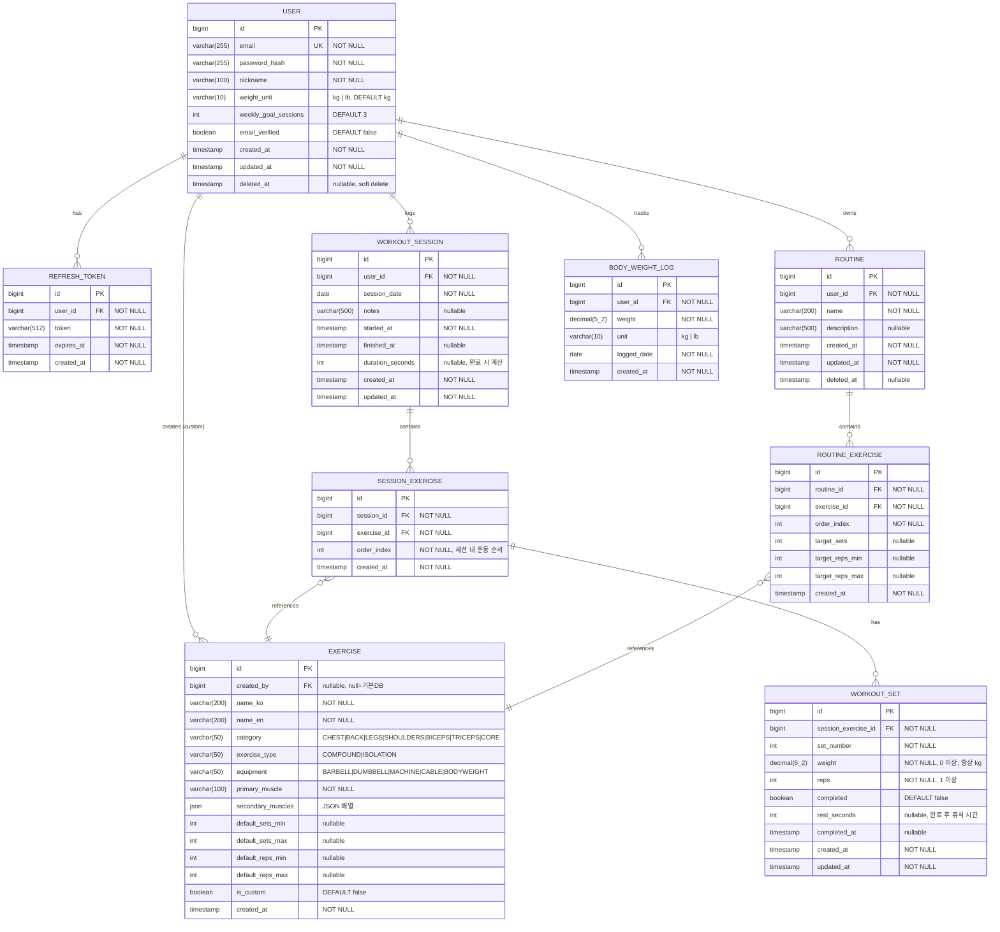

# ERD (Entity-Relationship Diagram)

## Mermaid ERD

## 엔티티 상세 설명

| 엔티티 | 설명 |
|---|---|
| **USER** | 회원 계정 정보. 소프트 삭제 적용. `weight_unit`은 사용자 선호 단위, DB 저장은 항상 kg. `weekly_goal_sessions`는 대시보드 주간 목표 표시용. |
| **REFRESH_TOKEN** | JWT Refresh Token 별도 저장. 로그아웃/탈취 의심 시 레코드 삭제로 토큰 폐기. |
| **EXERCISE** | 기본 운동 DB(`created_by = NULL`)와 사용자 커스텀 운동을 단일 테이블 관리. |
| **WORKOUT_SESSION** | 하루 복수 세션 허용. `started_at`은 생성 시 서버 시간, `finished_at`은 종료 시 기록. |
| **SESSION_EXERCISE** | 세션에 추가된 운동 목록. `order_index`로 순서 관리. |
| **WORKOUT_SET** | 핵심 기록 단위. `weight`는 항상 kg. `completed = false`는 계획된 세트, `true`는 완료 세트. |
| **ROUTINE / ROUTINE_EXERCISE** | P1 기능. 자주 쓰는 운동 조합 저장. |
| **BODY_WEIGHT_LOG** | P1 기능. 날짜별 체중 기록. |

## 인덱스 전략

| 테이블 | 인덱스 | 이유 |
|---|---|---|
| USER | `UNIQUE (email)` | 로그인/중복 검사 |
| USER | `INDEX (deleted_at)` | 소프트 삭제 필터링 |
| REFRESH_TOKEN | `INDEX (user_id)` | 사용자별 토큰 조회 |
| REFRESH_TOKEN | `INDEX (expires_at)` | 만료 토큰 배치 삭제 |
| EXERCISE | `INDEX (category, is_custom)` | 카테고리별 목록 |
| EXERCISE | `INDEX (created_by)` | 사용자 커스텀 운동 목록 |
| EXERCISE | `FULLTEXT (name_ko, name_en)` | 운동명 검색 (MySQL) |
| WORKOUT_SESSION | `INDEX (user_id, session_date DESC)` | 날짜순 세션 목록 |
| SESSION_EXERCISE | `INDEX (session_id, order_index)` | 세션 내 운동 순서 조회 |
| SESSION_EXERCISE | `INDEX (exercise_id)` | 특정 운동 히스토리 조회 |
| WORKOUT_SET | `INDEX (session_exercise_id, set_number)` | 세트 목록 조회 |
| BODY_WEIGHT_LOG | `INDEX (user_id, logged_date DESC)` | 날짜순 체중 목록 |
| ROUTINE | `INDEX (user_id, deleted_at)` | 사용자 루틴 목록 |
